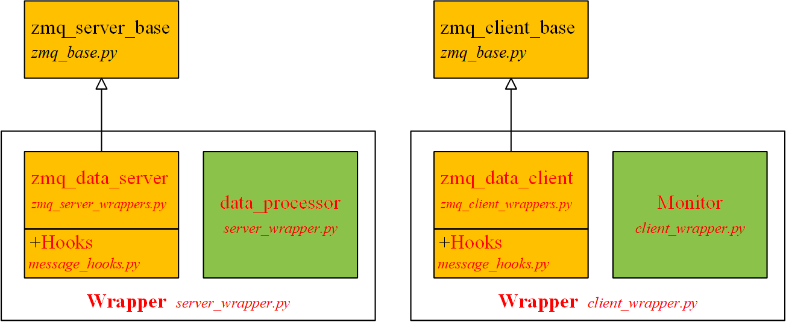
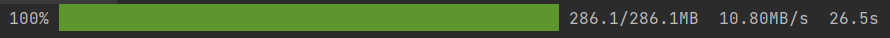

# 基于zeroMQ的传输工具封装

用于传输大规模数据，包括图像数据，或者其他任意格式的数据。所需传输的数据形式应以字典形式存储，一般而言zmq_base.py无需改动，特殊需求可重写相应的hooks函数(message_hooks.py)和对应的zmq封装即可。

可通过zmq在传输数据的同时提供进度条和传输速率接口。

## 代码结构



## 使用方法

主要新增加或者修改message_hooks.py文件中的hook函数, 并通过继承zmq_base中的基类来定义新的封装(具体可参考zmq_server_wrappers.py中的写法), server_wrapper和client_wrapper是一种更高级的封装形式，完全屏蔽了server和client的内部细节。
如果只是用来测试demo，可以在服务器上运行
```shell
python server_test.py
```
在客户端运行(需要在代码内修改图片加载位置)
```shell
python client_test.py
```

客户端运行效果(在100m局域网下进行测试)


